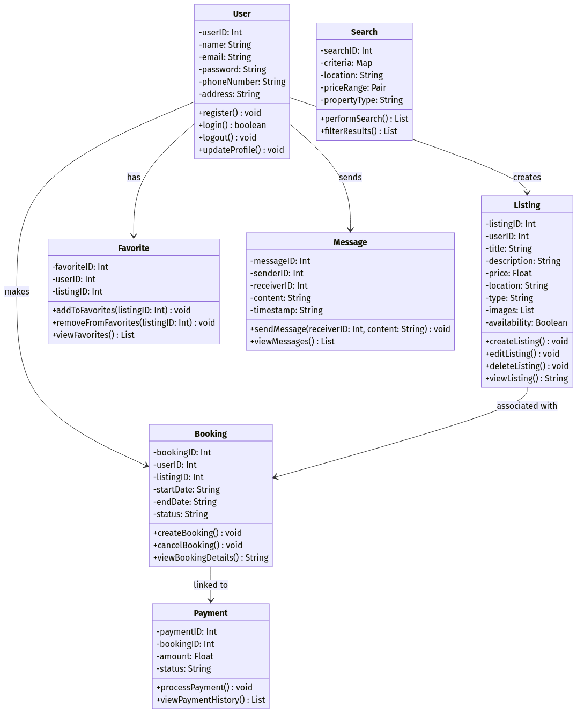
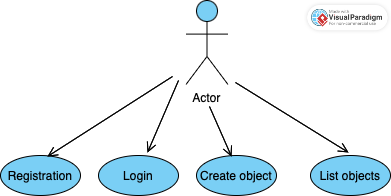
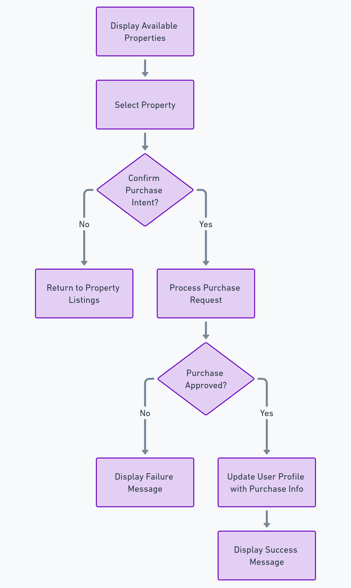
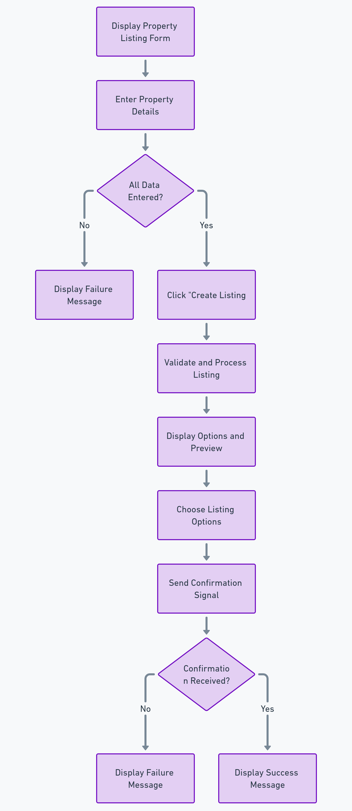
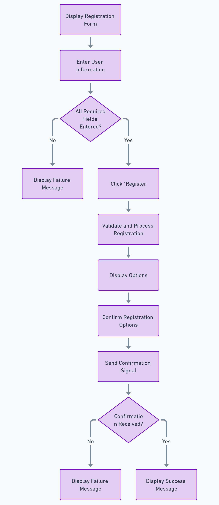
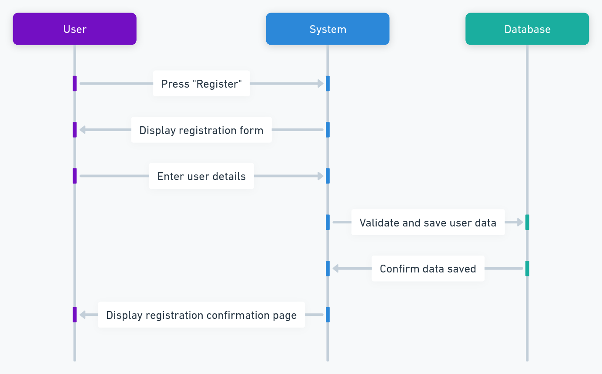
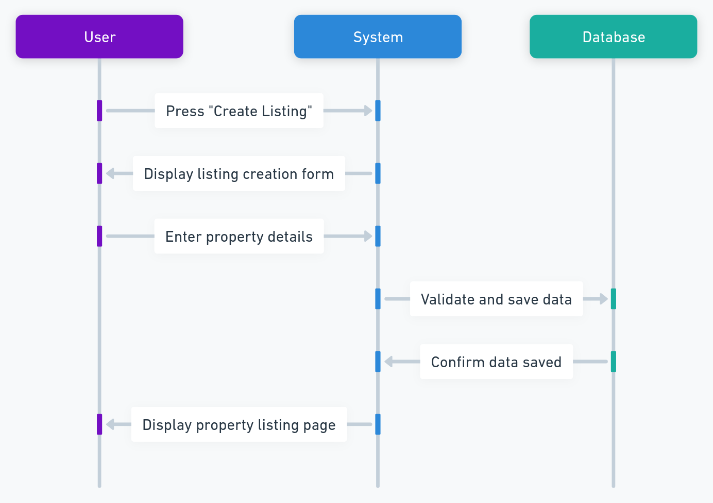
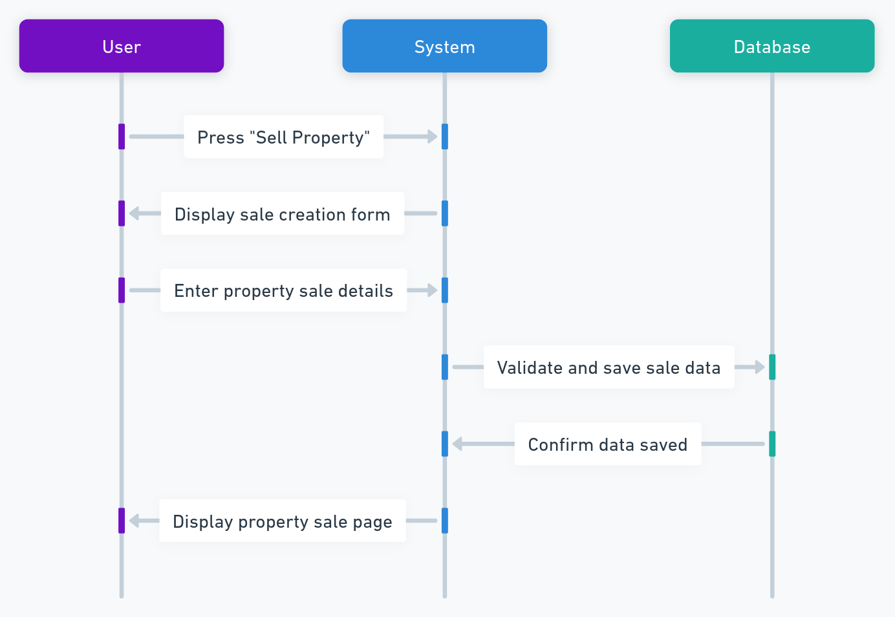
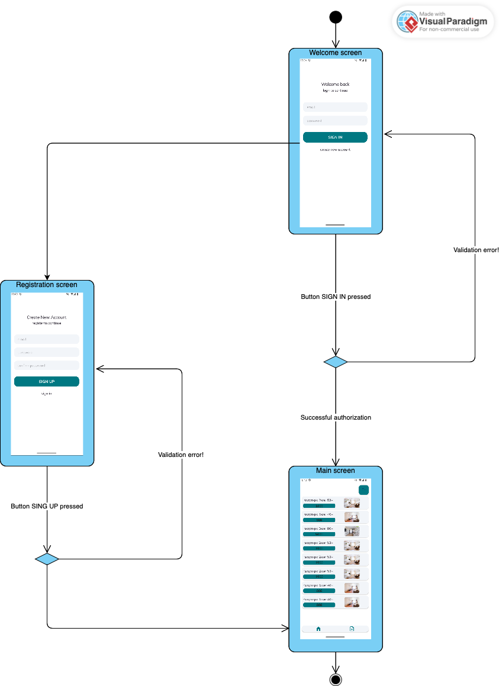
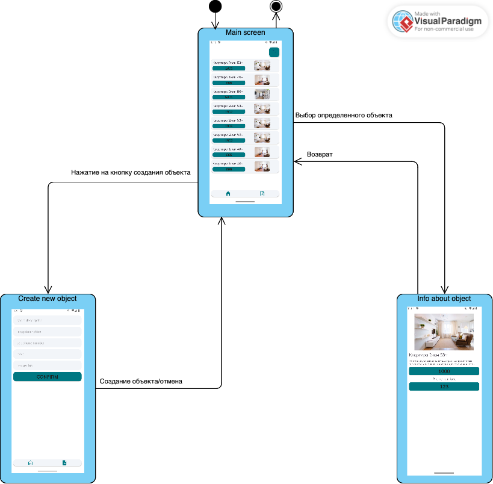

# Требования к проекту HomeFinder

## Содержание

- [1. Введение](#1-введение)
- [2. Требования пользователя](#2-требования-пользователя)
  - [2.1 Программные интерфейсы](#21-программные-интерфейсы)
  - [2.2 Интерфейс пользователя](#22-интерфейс-пользователя)
  - [2.3 Характеристики пользователей](#23-характеристики-пользователей)
  - [2.4 Предположения и зависимости](#24-предположения-и-зависимости)
- [3. Системные требования](#3-системные-требования)
  - [3.1 Функциональные требования](#31-функциональные-требования)
  - [3.2 Нефункциональные требования](#32-нефункциональные-требования)
    - [1. Надежность](#1-надежность)
    - [2. Безопасность](#2-безопасность)
    - [3. Производительность](#3-производительность)
    - [4. Масштабируемость](#4-масштабируемость)
    - [5. Удобство использования](#5-удобство-использования)
    - [6. Совместимость](#6-совместимость)
- [4. Модель предметной области](#4-модель-предметной-области)
  - [4.1 Диаграмма классов](#41-диаграмма-классов)
  - [4.2 Глоссарий к диаграмме классов](#42-глоссарий-к-диаграмме-классов)
- [5. Модель вариантов использования](#5-модель-вариантов-использования)
  - [5.1 Диаграмма вариантов использования](#51-диаграмма-вариантов-использования)
  - [5.2 Поток событий](#52-поток-событий)
- [6. Графический материал](#6-графический-материал)
  - [6.1 Диаграммы активности](#61-диаграммы-активности)
  - [6.2 Диаграммы последовательности](#62-диаграммы-последовательности)
  - [6.3 Диаграммы состояний](#63-диаграммы-состояний)
  - [6.4 Диаграмма компонентов и развертывания](#64-диаграмма-компонентов-и-развертывания)
- [7. Тестирование](#7-тестирование)
  - [7.1 План тестирования](#71-план-тестирования)
  - [7.2 Результат тестирования](#72-результат-тестирования)

## 1. Введение

HomeFinder - это приложение, которое предоставляет пользователям возможность легко и быстро находить, продавать и арендовать жилье. Приложение будет включать в себя функции поиска недвижимости по различным критериям, таким как местоположение, цена, количество комнат и другие параметры. Пользователи смогут просматривать фотографии и описания объектов.

Основные функции:
- Поиск недвижимости по различным фильтрам
- Просмотр подробной информации о каждом объекте, включая фотографии и описания
- Возможность связи с владельцами или агентами по недвижимости
- Сохранение избранных объектов для последующего просмотра

Продукт не будет включать в себя следующие функции:
- Проведение онлайн-аукционов или торгов по недвижимости
- Оформление документов для покупки или аренды недвижимости
- Предоставление юридических консультаций по вопросам недвижимости

## 2. Требования пользователя

### 2.1 Программные интерфейсы

- Android SDK
- Google Maps API
- JSON для хранения данных (не Firebase)
- Room для локального хранения данных
- Dagger-Hilt для внедрения зависимостей
- Jetpack Navigation Component для управления навигацией между различными экранами приложения
- Material Design Components для создания интерфейса
- Picasso для загрузки и кэширования фотографий

### 2.2 Интерфейс пользователя

Интерфейс пользователя будет реализован в виде мобильного приложения для Android с использованием Material Design. Основные экраны:

1. [Главный экран](mockups/mockup_1.png)
2. [Экран деталей объекта](mockups/mockup_3.png)
3. [Экран просмотра объектов](mockups/mockup_2.png)
4. [Экран авторизации](mockups/mockup_7.png)
5. [Экран избранных объектов](mockups/mockup_4.png)
6. [Экран добавления объекта](mockups/mockup_5.png)
7. [Экран редактирование объекта](mockups/mockup_6.png)

| Действие пользователя                     | Реакция системы                                                                         |
|-------------------------------------------|-----------------------------------------------------------------------------------------|
| Вход в приложение                         | Отображение главного экрана с списком объектов недвижимости и картой.                   |
| Ввод данных для регистрации/входа         | Проверка данных и переход на главный экран при успешной аутентификации.                 |
| Ввод ключевых слов в поисковую строку     | Отображение результатов поиска, соответствующих введенным ключевым словам.              |
| Выбор фильтров для поиска                 | Обновление списка объектов недвижимости в соответствии с выбранными фильтрами.          |
| Нажатие на объект недвижимости            | Переход на экран деталей объекта с подробной информацией.                               |
| Нажатие на кнопку "Сохранить в избранное" | Добавление объекта в список избранных и отображение уведомления об успешном сохранении. |
| Нажатие на кнопку "Связаться"             | Открытие формы для отправки сообщения или вызов звонка владельцу/агенту.                |
| Переход в раздел "Избранные объекты"      | Отображение списка сохраненных объектов недвижимости.                                   |
| Нажатие на кнопку "Удалить из избранного" | Удаление объекта из списка избранных и отображение уведомления об успешном удалении.    |
| Нажатие на кнопку "Добавить объект"       | Переход на экран добавления объекта с формой для ввода данных.                          |
| Заполнение формы добавления объекта       | Проверка данных и добавление объекта в базу данных при успешной проверке.               |

### 2.3 Характеристики пользователей

| Группа пользователей     | Уровень образования | Опыт                               | Техническая грамотность | Цели                                                                |
|--------------------------|---------------------|------------------------------------|-------------------------|---------------------------------------------------------------------|
| Покупатели и арендаторы  | Среднее и высшее    | Различный уровень опыта            | Средний уровень         | Поиск жилья, просмотр деталей, связь с владельцами/агентами         |
| Владельцы недвижимости   | Среднее и высшее    | Опыт в управлении недвижимостью    | Средний уровень         | Добавление и управление объектами, связь с потенциальными клиентами |
| Агенты по недвижимости   | Высшее              | Профессиональный опыт              | Высокий уровень         | Добавление и управление объектами, связь с клиентами, анализ данных |
| Инвесторы в недвижимость | Высшее              | Опыт в инвестировании и управлении | Высокий уровень         | Поиск и анализ инвестиционных возможностей, управление портфелем    |

### 2.4 Предположения и зависимости

- Приложение будет работать на устройствах с Android 6.0 и выше
- Для хранения данных будет использоваться локальное хранилище устройства
- Необходимо интернет-соединение

## 3. Системные требования

### 3.1 Функциональные требования

1. Пользователь может зарегистрироваться с использованием электронной почты, телефона или через социальные сети
2. Пользователь может войти в систему с использованием зарегистрированных данных
3. Пользователь может выполнять поиск объектов недвижимости по ключевым словам
4. Пользователь может просматривать подробную информацию о выбранном объекте недвижимости (фотографии, описание, цена, контактная информация владельца или агента)
5. Пользователь может сохранять объекты недвижимости в избранное
6. Пользователь может связаться с владельцем или агентом через звонок или сообщение
7. Пользователь может просматривать список сохраненных объектов недвижимости
8. Пользователь может удалять объекты из списка избранных

### 3.2 Нефункциональные требования

#### 1. Надежность
- **Описание:** Надежность системы означает ее способность функционировать без сбоев и ошибок в течение длительного времени.
- **Почему важно:** Поддерживает доверие пользователей и обеспечивает стабильную работу приложения.
- **Как измеряется:**
    - MTBF (Mean Time Between Failures): Среднее время между сбоями.
    - MTTR (Mean Time To Repair): Среднее время на восстановление после сбоя.
    - Уровень доступности: Процент времени, в течение которого система доступна для пользователей.

#### 2. Безопасность
- **Описание:** Безопасность системы включает защиту данных пользователей и объектов недвижимости от несанкционированного доступа и утечек.
- **Почему важно:** Защищает личные данные пользователей и предотвращает мошенничество.
- **Как измеряется:**
    - Число инцидентов безопасности: Количество случаев несанкционированного доступа или утечек данных.
    - Соответствие стандартам безопасности: Проверка соответствия системы стандартам и нормативным требованиям (например, GDPR, ISO 27001).
    - Аудит безопасности: Регулярные проверки и тестирование системы на уязвимости.

#### 3. Производительность
- **Описание:** Производительность системы определяет, насколько быстро и эффективно приложение выполняет свои функции.
- **Почему важно:** Высокая производительность важна для положительного пользовательского опыта и удержания пользователей.
- **Как измеряется:**
    - Время отклика: Время, необходимое для выполнения запросов пользователя.
    - Пропускная способность: Количество запросов, которые система может обработать за единицу времени.
    - Использование ресурсов: Процент использования процессора, памяти и других ресурсов.

#### 4. Масштабируемость
- **Описание:** Масштабируемость системы означает ее способность эффективно работать при увеличении числа пользователей и объема данных.
- **Почему важно:** Поддерживает производительность и надежность приложения при росте пользовательской базы.
- **Как измеряется:**
    - Горизонтальная масштабируемость: Способность системы добавлять новые серверы или узлы для обработки увеличивающейся нагрузки.
    - Вертикальная масштабируемость: Способность системы увеличивать ресурсы существующих серверов (например, процессор, память).
    - Тестирование нагрузки: Проверка системы на способность обрабатывать увеличивающееся количество запросов.

#### 5. Удобство использования
- **Описание:** Удобство использования системы определяет, насколько легко и интуитивно пользователи могут взаимодействовать с приложением.
- **Почему важно:** Важно для привлечения и удержания пользователей, а также для положительного пользовательского опыта.
- **Как измеряется:**
    - Оценка пользовательского опыта (UX): Проведение тестирования с реальными пользователями и сбор отзывов.
    - Анализ поведения пользователей: Изучение данных о том, как пользователи взаимодействуют с приложением.
    - Опросы и анкеты: Сбор обратной связи от пользователей о их опыте использования приложения.

#### 6. Совместимость
- **Описание:** Совместимость системы означает ее способность работать на различных устройствах и операционных системах.
- **Почему важно:** Обеспечивает доступность приложения для широкой аудитории пользователей.
- **Как измеряется:**
    - Тестирование на различных устройствах: Проверка работы приложения на разных моделях смартфонов и планшетов.
    - Тестирование на различных операционных системах: Проверка работы приложения на разных версиях Android и iOS.
    - Анализ отзывов пользователей: Сбор отзывов о работе приложения на различных устройствах и операционных системах.

## 4. Модель предметной области
### 4.1 Диаграмма классов

### 4.2 Глоссарий к диаграмме классов

| Класс       | Атрибуты                                                                                                       | Методы                                                                                                   | Описание |
|-------------|-----------------------------------------------------------------------------------------------------------------|----------------------------------------------------------------------------------------------------------|----------|
| **User**    | `userID: Int`, `name: String`, `email: String`, `password: String`, `phoneNumber: String`, `address: String`, `loggedIn: Boolean` | `register(): void`, `login(): boolean`, `logout(): void`, `updateProfile(): void`                        | Представляет пользователя системы с личными данными и методами аутентификации. |
| **Search**  | `searchID: Int`, `criteria: Map`, `location: String`, `priceRange: Pair`, `propertyType: String`               | `performSearch(): List`, `filterResults(): List`                                                         | Обрабатывает функционал поиска с критериями, такими как местоположение, диапазон цен и тип недвижимости. |
| **Favorite** | `favoriteID: Int`, `userID: Int`, `listingID: Int`                                                            | `addToFavorites(listingID: Int): void`, `removeFromFavorites(listingID: Int): void`, `viewFavorites(): List` | Управляет избранными объявлениями пользователя, позволяя добавлять, удалять и просматривать избранное. |
| **Message** | `messageID: Int`, `senderID: Int`, `receiverID: Int`, `content: String`, `timestamp: String`                   | `sendMessage(receiverID: Int, content: String): void`, `viewMessages(): List`                            | Представляет сообщения, отправляемые между пользователями, с методами для отправки и просмотра сообщений. |
| **Listing** | `listingID: Int`, `userID: Int`, `title: String`, `description: String`, `price: Float`, `location: String`, `type: String`, `images: List`, `availability: Boolean` | `createListing(): void`, `editListing(): void`, `deleteListing(): void`, `viewListing(): String` | Представляет объявление о недвижимости с такими данными, как заголовок, описание, цена, местоположение и статус доступности. |
| **Booking** | `bookingID: Int`, `userID: Int`, `listingID: Int`, `startDate: String`, `endDate: String`, `status: String`    | `createBooking(): void`, `cancelBooking(): void`, `viewBookingDetails(): String`                         | Управляет деталями бронирования, позволяя пользователям создавать, отменять и просматривать информацию о бронировании. |
| **Payment** | `paymentID: Int`, `bookingID: Int`, `amount: Float`, `status: String`                                          | `processPayment(): void`, `viewPaymentHistory(): List`                                                   | Обрабатывает транзакции платежей по бронированиям, с методами для проведения и просмотра истории платежей. |

## 5. Модель вариантов использования

### 5.1 Диаграмма вариантов использования

### 5.2 Поток событий

### 1. Акторы

| Актор        | Описание                                                  |
|--------------|-----------------------------------------------------------|
| Пользователь | Человек, использующий систему для продажи и аренды жилья. |

### 2. Варианты использования

#### 2.1 Зарегистрировать аккаунт

**Описание**: Пользователь регистрирует новый аккаунт в системе.
- **Предусловия**: Пользователь не зарегистрирован.
- **Основной поток**:
  1. Пользователь открывает страницу регистрации.
  2. Вводит необходимые данные (e-mail, пароль, имя).
  3. Нажимает кнопку "Зарегистрироваться".
  4. Система проверяет корректность данных и создает аккаунт.
  5. Система подтверждает успешную регистрацию.
- **Альтернативные потоки**:
  1. Ошибка валидации данных — система отображает сообщение об ошибке.

#### 2.2 Войти в систему

**Описание**: Пользователь авторизуется в системе.
- **Предусловия**: Пользователь зарегистрирован.
- **Основной поток**:
  1. Пользователь открывает страницу входа.
  2. Вводит e-mail и пароль.
  3. Нажимает "Войти".
  4. Система проверяет учетные данные.
  5. Система авторизует пользователя и предоставляет доступ к функционалу.
- **Альтернативные потоки**:
  1. Неправильные данные — система отображает сообщение об ошибке.

#### 2.3 Создать объект

**Описание**: Пользователь создает новый объект.
- **Предусловия**: Пользователь авторизован.
- **Основной поток**:
  1. Пользователь нажимает кнопку "Создать объект".
  2. Вводит название объекта и описание.
  3. Нажимает "Создать".
  4. Система добавляет объект в список.
  5. Объект отображается на главной странице.

#### 2.4 Просматривать объект

**Описание**: Пользователь просматривает интересующий его объект.
- **Предусловия**: Проект существует и пользователь авторизован.
- **Основной поток**:
  1. Пользователь находится на главной странице.
  2. Пользователь выбирает интересный ему объект.
  3. Происходит переход на страницу объекта со всей информацией.

#### 2.5 Выход из аккаунта

**Описание**: Пользователь выходит из аккаунта.
- **Предусловия**: Пользователь авторизован.
- **Основной поток**:
  1. Пользователь находится на главной странице приложения.
  2. Пользователь нажимает на кнопку в левом верхнем углу.
  3. Пользователь выходит из системы.

### 3. Глоссарий

| Термин  | Описание                                                                     |
|---------|------------------------------------------------------------------------------|
| Объект  | Основная единица приложения - жилье                                          |
| Аккаунт | Учетная запись пользователя, содержащая данные для входа и работы в системе. |

## 6. Графический материал

### 6.1 Диаграммы активности

#### 6.1.1 Диаграмма активности 1

#### 6.1.2 Диаграмма активности 2

#### 6.1.3 Диаграмма активности 3

### 6.2 Диаграммы последовательности

#### 6.2.1 Диаграмма последовательности 1

#### 6.2.2 Диаграмма последовательности 2

#### 6.2.3 Диаграмма последовательности 3

### 6.3 Диаграммы состояний

#### 6.3.1 Диаграмма состояния 1

#### 6.3.2 Диаграмма состояния 2

### 6.4 Диаграмма компонентов и развертывания

[Ссылка на диаграмму](component/components.pdf)

## 7. Тестирование

### 7.1 План тестирования

## Введение

Данный документ описывает план тестирования приложения "HomeFinder". Документ предназначен для людей, выполняющих тестирование данного проекта. Цель тестирования - проверка соответствия реального поведения программы проекта и ее ожидаемого поведения.

## Объект тестирования

В качестве объектов тестирования можно выделить следующие функциональные требования:

* Создание объектов
* Просмотр деталей определенного объекта
* Просмотр списка объектов
* Регистрация пользователя
* Авторизация пользователя

## Атрибуты качества

1. Функциональность:
  - функциональная полнота: приложение должно выполнять все заявленные функции
  - функциональная корректность: приложение должно выполнять все заявленные функции корректно
2. Удобство использования:
  - интуитивно понятный интерфейс
  - все функциональные элементы имеют понятные названия
  - удобная навигация между разделами

## Риски

К рискам можно отнести:
* Потеря локальных данных при сбое устройства
* Конфликты при одновременном доступе к данным
* Проблемы совместимости с различными версиями Android

## Аспекты тестирования

В ходе тестирования планируется проверить реализацию основных функций приложения:

### Управление объектами
* Создание нового объекта
* Просмотр определенного объекта
* Просмотр списка всех объектов

### Регистрация пользователя
* Проверка данных на ввод при регистрации
* Успешная регистрация
* Переход на главную страницу

### Авторизация пользователя
* Проверка данных на ввод при авторизации
* Успешная авторизация
* Переход на главную страницу

### Интерфейс
* Корректное отображение всех элементов
* Работа навигации
* Адаптивность интерфейса

## Подходы к тестированию

При тестировании будут использованы:
* Ручное тестирование
* Модульное тестирование
* Интеграционное тестирование
* UI-тестирование

### 7.2 Результат тестирования

| Сценарий                                                               | Действие                                                                         | Ожидаемый результат                                                  | Фактический результат                                          | Оценка                |
|:-----------------------------------------------------------------------|:---------------------------------------------------------------------------------|:---------------------------------------------------------------------|:---------------------------------------------------------------|:----------------------|
| 001-1: Запуск приложения                                               | Запустить приложение на устройстве Android                                       | Успешный запуск приложения                                           | Приложение запускается                                         | Тест пройден          |
| 001-2: Отображение интерфейса                                          | Проверка соответствия интерфейса макетам                                         | Интерфейс соответствует макетам                                      | Частичное соответствие макетам                                 | Тест пройден частично |
| 002-1: Создание объекта                                                | Нажать кнопку создания нового объекта и заполнить данные                         | Создание нового объекта                                              | Объект создается с заполненными ранее полями                   | Тест пройден          |
| 002-2: Просмотр объекта                                                | Открыть существующий объект                                                      | Открытие страницы объекта со всеми данными                           | Страница объекта открыта                                       | Тест пройден          |
| 002-3: Просмотр списка объектов                                        | Перейти на главную страницу приложения                                           | Список объектов отображен корректно                                  | Список объектов отображен корректно                            | Тест пройден          |
| 003-1: Успешная регистрация пользователя                               | Ввод корректных данных для регистрации нового пользователя в системе             | Пользователь успешно зарегистрирован в системе                       | Пользователь успешно зарегистрирован в системе                 | Тест пройден          |
| 003-2: Неуспешная регистрация пользователя                             | Ввод некорректных данных для регистрации нового пользователя в системе           | Пользователь не будет зарегистрирован и получит сообщение об ошибках | Пользователь не зарегистрирован и получил сообщение об ошибках | Тест пройден          |
| 003-3: Переход на главную страницу приложения при успешной регистрации | Произойдет переход на главную страницу приложения                                | Переход на главную страницу приложения произведен                    | Переход на главную страницу приложения произведен              | Тест пройден          |
| 004-1: Успешная авторизация пользователя                               | Ввод корректных данных для авторизации существующего пользователя в системе      | Пользователь успешно авторизирован                                   | Пользователь успешно авторизирован                             | Тест пройден          |
| 004-2: Неуспешная авторизация пользователя                             | Ввод некорректных данных для авторизации существующего пользователя в системе    | Пользователь не авторизован и получит сообщение об ошибках           | Пользователь не авторизован и получил сообщение об ошибках     | Тест пройден          |
| 004-3: Переход на главную страницу приложения при успешной авторизации | Произойдет переход на главную страницу приложения                                | Переход на главную страницу приложения произведен                    | Переход на главную страницу приложения произведен              | Тест пройден          |
| 005-1: Сохранение данных                                               | Проверка сохранения данных при перезапуске                                       | Сохранение всех данных                                               | Данные сохраняются локально                                    | Тест пройден          |
| 006-1: Навигация                                                       | Проверка переходов между экранами                                                | Корректная навигация                                                 | Навигация работает                                             | Тест пройден          |
| 007-1: Адаптивность интерфейса                                         | Проверка интерфейса приложения на разных устройствах с разным разрешением экрана | Корректное отображение на всех устройствах                           | Интерфейс корректно отображается на всех устройствах           | Тест пройден          |

## Замечания
* Необходимо улучшить соответствие интерфейса макетам
* Требуется доработка функционала управления объектами
* Ограниченная функциональность приложения
* Отсутствует часть планируемого функционала по категоризации
* Требуется оптимизация производительности при работе с большим количеством объектов

## Общий вывод
Базовый функционал приложения реализован и работает стабильно. Основные функции управления задачами выполняются корректно. Требуется доработка некоторых компонентов и расширение функциональности в соответствии с планом развития проекта. Приложение может использоваться для базового управления задачами, но требует дальнейшего развития для полного соответствия заявленным требованиям.

## Выводы

Данный тестовый план позволяет проверить основной функционал приложения HomeFinder. Успешное прохождение всех тестов не гарантирует полной работоспособности на всех устройствах и версиях Android, однако позволяет утверждать о корректной работе основных функций приложения. Тестирование должно проводиться регулярно при внесении существенных изменений в код проекта.